<div align="center">



# `TUSHAR DAS`_

### `FULL-STACK DEVELOPER • AI/ML BUILDER • PROBLEM SOLVER`

> `root@tushar:~$` **I build practical software that turns real-world problems into working products.**

<a href="https://github.com/KenKaneki23-ux">

</a>

<a href="https://www.linkedin.com/">

</a>

</div>

<div align="center">
  
</div>

## `> about_me`
```javascript
const tushar = {
  role: "Full-Stack Developer",
  education: "B.Tech Computer Science & Engineering",
  interests: ["AI/ML", "Full-Stack", "Mobile", "System Design"],
  currentlyBuilding: "AI-powered Lost & Found System",
  mindset: "Build → Learn → Break → Fix → Repeat"
};
```

<div align="center">
  
</div>

## `> tech_stack`
<div align="center"></div>

<div align="center">
  
</div>

## `> featured_projects`
<table><tr><td width="50%">

### 🛡️ SHEildAI
AI-powered personal safety platform with route risk analysis, voice SOS, location alerts and emergency workflows.

**Stack:** React Native · Node.js · MongoDB · Kotlin

<a href="https://github.com/KenKaneki23-ux/SHEildAI">View Project →</a>

</td><td width="50%">

### 🔎 Lost & Found
Full-stack platform with AI-assisted item matching, claims, community support and moderation.

**Stack:** React · Node.js · PostgreSQL · Prisma

<a href="https://github.com/KenKaneki23-ux/lost">View Project →</a>

</td></tr><tr><td>

### 🎓 Alumni Connect
Networking and mentorship platform for students and alumni.

**Stack:** Flask · MongoDB · Jinja2

<a href="https://github.com/KenKaneki23-ux/Alumni-Connect">View Project →</a>

</td><td>

### 🛒 Local Online Store
Full-stack e-commerce platform focused on local businesses.

**Stack:** React · Express · MongoDB

<a href="https://github.com/KenKaneki23-ux/Local-Online-Store">View Project →</a>

</td></tr></table>

<div align="center">
  
</div>

## `> what_i_build`
```text
[01] AI / ML systems
[02] Full-stack web applications
[03] Mobile applications
[04] Safety & community platforms
[05] Developer tools & experiments
```

<div align="center">
  
</div>

## `> github_activity`
<div align="center">


<br/>

</div>

<div align="center">
  
</div>

## `> current_status`
```text
● ONLINE

> coding
> building projects
> learning something new
> turning ideas into reality
```

<div align="center">
  
</div>

<div align="center">

### `> Some people watch the world change. I prefer to build it._`

`BUILD • LEARN • BREAK • FIX • REPEAT`

</div>
